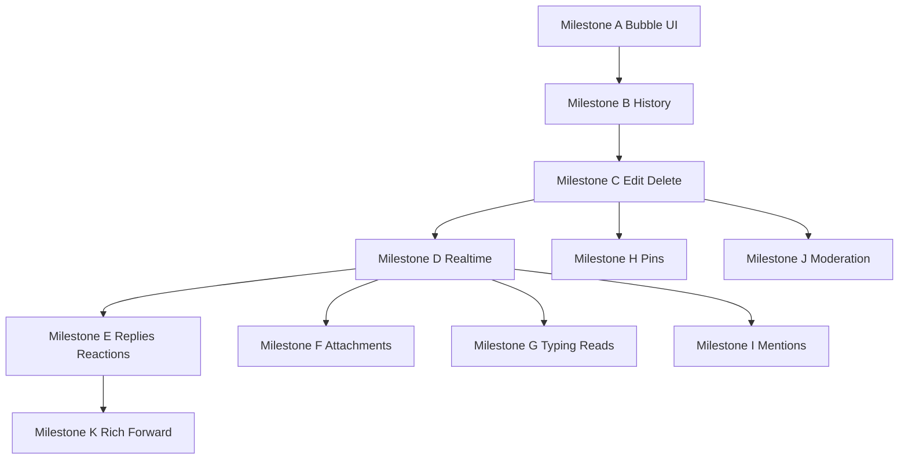

# Classroom chat — implementation plan

**Scope:** Upgrade classroom discussion from polled REST text chat into a full-featured thread (edit/delete, history, realtime, replies, reactions, attachments, etc.) with **Telegram-style bubbles** (avatar + tail, roles, name colors).

**Primary surfaces:** [`frontend/src/pages/ChatRoom.jsx`](frontend/src/pages/ChatRoom.jsx) · [`backend/src/controllers/chatController.js`](backend/src/controllers/chatController.js) · [`backend/src/routes/chatRoutes.js`](backend/src/routes/chatRoutes.js) · [`backend/src/models/Message.js`](backend/src/models/Message.js) · [`backend/src/socket/index.js`](backend/src/socket/index.js)

**Today:** Classroom chat uses REST polling; Socket.IO already exposes `joinChat`, `sendMessage`, `typing`, `markAsRead` but **ChatRoom does not use** [`SocketContext`](frontend/src/contexts/SocketContext.jsx).

**Risk:** [`getChatMessages`](backend/src/controllers/chatController.js) sorts `createdAt: 1` with offset pagination — verify whether the UI loads **latest** messages or an **old window** when `limit` is large; fix as part of Milestone B.

---

## Milestones (execute in order)

| Milestone | What ships | Depends on |
|-----------|------------|------------|
| **A — Bubble UI** | Telegram-style rows (avatar, tail, name hue, Owner/Admin chip, timestamp layout); light/dark tokens; optional subtle thread background pattern | None |
| **B — History contract** | Correct “recent window” + load older (cursor or `before`); trim reliance on naive polling for correctness | A (layout stable) |
| **C — Phase 1 CRUD** | `editedAt` / soft `deletedAt`; PATCH edit (sender); DELETE soft (sender + admin); repair `chat.lastMessage`; message menu on bubbles | B |
| **D — Realtime** | ChatRoom: `joinChat`, listeners for new/update/delete messages; optional emit path parity with REST; reduce/stop polling when connected | C |
| **E — Social** | Reply-to (`replyTo`), reactions API + UI + socket | D |
| **F — Attachments** | Upload pipeline + composer + render (`messageType` / `fileUrl`) | D |
| **G — Presence polish** | Typing + read receipt UI wired to existing socket events | D |
| **H — Pins** | `Chat.metadata.pinnedMessageIds` (cap), admin pin/unpin, top strip | C |
| **I — Mentions** | Parse `@`, resolve to member ids, persist on Message; **new** notification persistence (current feed is announcements-only) | D |
| **J — Moderation** | Report flag, slow mode, admin bulk actions as needed | C |
| **K — Rich + forward** | Sanitized markdown subset; forward = prefill composer with attribution | E (optional) |

---

## Feature detail (by milestone)

### A — Bubble UI (design reference)

- Row: **circle avatar** + **bubble**; incoming tail left; outgoing mirrored with distinct fill.
- Header: bold **linked name**, **stable color per userId hash**, text labels **Owner** / **Admin** from [`creator` / `admins`](frontend/src/utils/classroom.js).
- Body + **timestamp** bottom-right inside bubble, muted meta style.
- Tail: CSS pseudo-element or SVG; tokens `--classroom-bubble-in` / `--classroom-bubble-out` for themes.
- Optional low-contrast **pattern** on scroll area; static only for `prefers-reduced-motion`.

### B — History

- Define API contract: default returns **latest N** messages; **load older** via cursor (`before=_id` or `before=ISO`).
- ChatRoom: prepend older pages on scroll-up; debounce requests.

### C — Edit / delete

- Schema: `editedAt`, `deletedAt` (soft), optional `moderatedBy`.
- Permissions: edit/delete own; admins/creator delete any (reuse `canManageClassroomContent`).
- Socket: `messageUpdated` / `messageDeleted` (or unified payload) for D.

### D — Realtime

- Wrap ChatRoom with socket join/leave lifecycle; subscribe to message streams; fallback poll if disconnected.

### E–K

- As summarized in table; reactions subdocument; uploads reuse existing patterns; notifications schema extension for I.

---

## Definition of done (project-level)

- No regression for non-members (403).
- `assertCanWrite` on mutating routes unchanged policy.
- Light + dark themes readable (contrast).
- Mobile drawer participants unchanged unless explicitly redesigned.

---

## Execution gate

When you are ready to **implement** (not just plan), switch to **Agent mode** and specify the milestone (e.g. “Implement Milestone A + B” or “start at A”).

---

## Todo index

| ID | Item |
|----|------|
| milestone-a | Telegram-style bubbles + tokens + role chips |
| milestone-b | Message ordering + pagination / load older |
| milestone-c | Edit/delete REST + schema + menus + lastMessage |
| milestone-d | Socket wiring in ChatRoom |
| milestone-e | Replies + reactions |
| milestone-f | Attachments |
| milestone-g | Typing + read receipts UI |
| milestone-h | Pins |
| milestone-i | Mentions + notifications persistence |
| milestone-j | Moderation extras |
| milestone-k | Rich text + forward |

---

*Plan consolidated: milestones, dependencies, execution order, and UI spec in one doc.*
